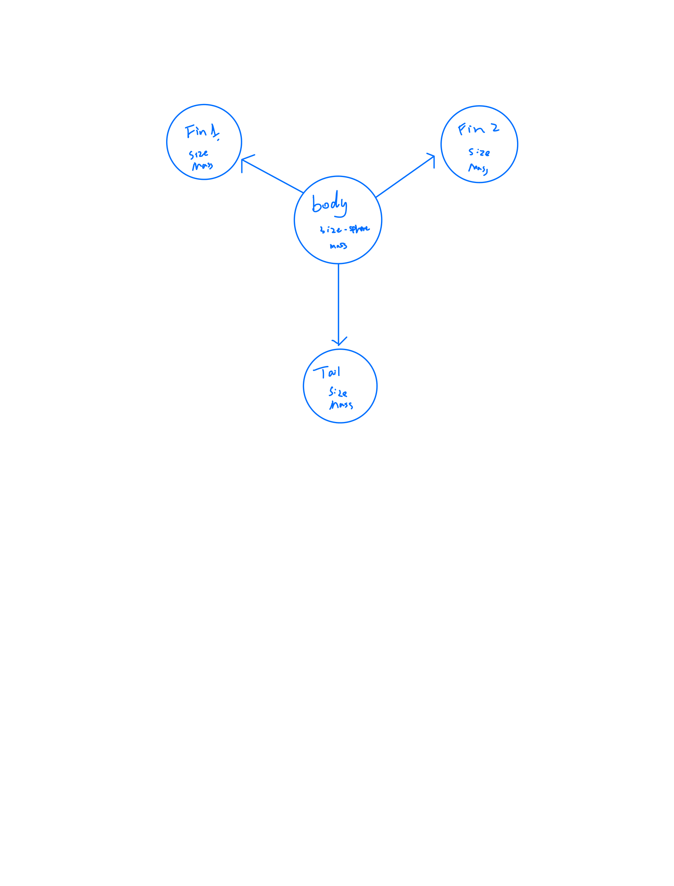
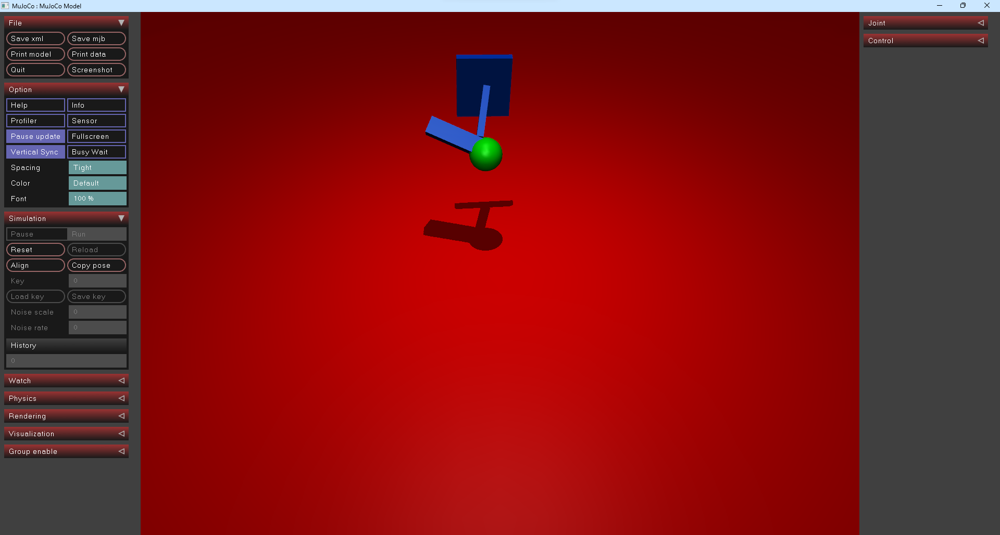
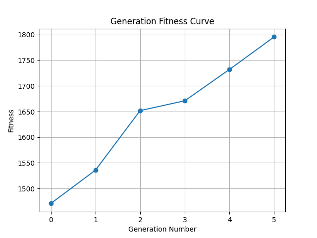

# Artificial Life Final Project

This project explores the dynamics of artificial life through simulation and analysis. It involves the evolution and adaptation of digital organisms within a simulated environment.

## Video Link

[Final presentation link: https://youtu.be/3xWwPU6_qPY](https://youtu.be/3xWwPU6_qPY)

## Genotype Graph

## Sample from Generations

This graph showcases a sample population from various generations, illustrating the diversity and evolution of digital organisms.

## Generation Fitness Curve

The generation fitness curve demonstrates the trend of fitness levels across successive generations, reflecting the overall progress and adaptation of the population.

## Steps to Run

To run the simulation:

1. Clone this repository to your local machine.
2. Install the required dependencies using `pip install -r requirements.txt`.
3. Adjust parameters as needed for your experiment.
4. Execute the main script `get_result.py`.
5. Genotype information would be saved in output.csv
6. Analyze the results and visualize the data using provided tools or scripts.